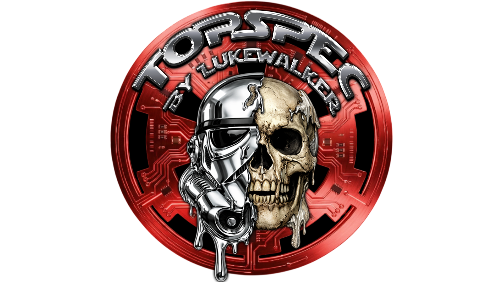

# Personal Website — Customisation Guide

A minimal, serverless personal website. No build step, no dependencies — just open `index.html` in a browser or serve it via Pinokio.

---

## File Overview

```
project-root/
├── index.html              # The entire website (HTML + CSS + JS in one file)
├── pinokio.json            # Pinokio metadata (title, description, icon)
├── README.md               # This file
└── .pinokio-temp/          # Temporary assets (video, images, etc.)
```

---

## Step-by-Step Customisation

### 1. Your Name & Initials

Open `index.html` and scroll to the bottom. Find the `PROFILE` object inside the `<script>` tag:

```js
const PROFILE = {
  name:     "Topspec",
  initials: "TS",
  bio:      "test website made with claude.",
  email:    "you@example.com",
};
```

- **`name`** — Your display name shown as the page heading.
- **`initials`** — Shown inside the avatar circle if no photo is set (e.g. `"TS"` for Topspec).
- **`bio`** — The short tagline shown below your name.
- **`email`** — Used by the contact form's `mailto:` link.

---

### 2. Avatar / Profile Photo

#### Option A — Use initials (default)
No action needed. The avatar circle shows your initials from `PROFILE.initials`.

#### Option B — Use a photo
1. Place your image file (e.g. `avatar.jpg`) in the project root folder.
2. In `index.html`, find the avatar `<div>` near the top of `<body>`:
   ```html
   <div class="avatar" id="avatar">
     
   </div>
   ```
3. Replace `logo.png` with your image filename:
   ```html
   
   ```

---

### 3. Social / Contact Links

Find the `<nav class="social-links">` block in `index.html`:

```html
<nav class="social-links">
  <a href="https://github.com/topspec" target="_blank" rel="noopener">
    ... GitHub
  </a>
  <a href="mailto:you@example.com">
    ... Email
  </a>
</nav>
```

- **Change GitHub URL** — Replace `https://github.com/topspec` with your profile URL.
- **Change email** — Replace the `mailto:` address (also update `PROFILE.email` in the script).
- **Add a new link** — Copy an existing `<a>` block and change the `href`, icon SVG, and label text.
- **Remove a link** — Delete the entire `<a>...</a>` block.

---

### 4. Product / Project Cards

Each card follows this structure:

```html
<a class="project-card" href="LINK_URL" target="_blank" rel="noopener">
  
  <div class="project-info">
    <div class="project-name">PRODUCT NAME</div>
    <div class="project-desc">Short description here.</div>
    <div class="project-tags">
      <span class="tag">Tag One</span>
      <span class="tag">Tag Two</span>
    </div>
  </div>
  <span class="project-arrow">↗</span>
</a>
```

**To edit a card:**
1. Change `href="LINK_URL"` to your product/project URL.
2. Change `src="IMAGE_URL"` to a local file path or remote image URL. Remove the `` line entirely if you don't want a thumbnail.
3. Update the name, description, and tags.

**To add a card:** Copy the entire `<a class="project-card">...</a>` block and paste it inside the `<div class="projects-grid">` container.

**To remove a card:** Delete the entire `<a class="project-card">...</a>` block.

**To rename the section heading:** Find `<p class="section-label">Products</p>` and change the text.

---

### 5. Background Video

The background video is set in `index.html` near the top of `<body>`:

```html
<video id="bg-video" src=".pinokio-temp/background.mp4" autoplay muted loop playsinline></video>
```

- **Change video** — Replace `.pinokio-temp/background.mp4` with your video file path.
- **Remove video** — Delete this line entirely, and remove the `#bg-video` CSS block.

**Adjust opacity** — Find the `#bg-video` CSS rule:

```css
#bg-video {
  ...
  opacity: 0.75;
}
```

Change `0.75` to any value between `0` (invisible) and `1` (fully visible).

---

### 6. Card Appearance

Find the CSS variables at the top of the `<style>` block:

```css
:root {
  --card: rgba(10, 10, 20, 0.72);       /* Card background */
  --card-dark: rgba(10, 10, 20, 0.72);  /* Card background (dark mode) */
  --text: #ffffff;                       /* Main text colour */
  --text-dark: #ffffff;                 /* Main text colour (dark mode) */
  --muted: #c0c8d8;                     /* Secondary/description text */
  --accent: #2563eb;                    /* Tag and link highlight colour */
}
```

- **Darken/lighten cards** — Lower the last value in `rgba(10, 10, 20, X)` for more transparency, raise it for more opacity (max `1`).
- **Change text colour** — Edit `--text` and `--text-dark`.
- **Change accent colour** — Edit `--accent` (used for tags, link hovers, focus rings, and the Send button).

---

### 7. Contact Form

The form uses `mailto:` by default — clicking Send opens your email client with the message pre-filled. No server required.

**To use a real form backend (e.g. Formspree):**

1. Sign up at [formspree.io](https://formspree.io) and create a form. You'll get an endpoint like `https://formspree.io/f/xabcdefg`.
2. In `index.html`, find the submit handler in the `<script>` tag and replace the `mailto:` logic with:

```js
document.getElementById("contactForm").addEventListener("submit", async function(e) {
  e.preventDefault();
  const data = new FormData(e.target);
  await fetch("https://formspree.io/f/YOUR_FORM_ID", {
    method: "POST",
    body: data,
    headers: { Accept: "application/json" }
  });
  document.getElementById("contactForm").style.display = "none";
  document.getElementById("formSuccess").style.display = "block";
});
```

---

### 8. Page Title & Pinokio Metadata

**Browser tab title** — Automatically set from `PROFILE.name` in the script. No separate change needed.

**Pinokio sidebar title & description** — Edit `pinokio.json`:

```json
{
  "title": "personal-website",
  "description": "Minimal personal website with avatar, bio, projects, and contact form"
}
```

**Pinokio icon** — Add an `icon.png` to the project root and set:

```json
{
  "icon": "icon.png"
}
```

---

## Quick Reference

| What to change | Where |
|---|---|
| Name, bio, email | `PROFILE` object in `<script>` tag |
| Avatar photo | `<div class="avatar">` — swap `` |
| Social links | `<nav class="social-links">` |
| Product cards | `<div class="projects-grid">` |
| Section heading | `<p class="section-label">` |
| Background video | `<video id="bg-video" src="...">` |
| Video opacity | `#bg-video { opacity: X }` in CSS |
| Card darkness | `--card` variable in `:root` CSS |
| Text colour | `--text` variable in `:root` CSS |
| Accent colour | `--accent` variable in `:root` CSS |
| Pinokio title | `pinokio.json` → `title` |
| Payment links | `handlePayment()` function in `<script>` tag |

---

## Payment Section

The site includes three payment buttons — **Bitcoin**, **PayPal**, and **Card**. They currently show a test message when clicked. Follow the steps below to activate each one.

---

### Bitcoin

1. Find the `handlePayment` function in the `<script>` tag at the bottom of `index.html`.
2. Uncomment and replace the Bitcoin line with your wallet address:
   ```js
   window.location.href = "bitcoin:YOUR_WALLET_ADDRESS";
   ```
   Or use a Coinbase Commerce hosted checkout:
   ```js
   window.location.href = "https://commerce.coinbase.com/checkout/YOUR_CHECKOUT_ID";
   ```

**Bitcoin button logo:**
To replace the `₿` symbol with a real Bitcoin logo image:
1. Save your Bitcoin logo as `bitcoin-logo.png` in the project root.
2. In `index.html`, find the Bitcoin button and replace:
   ```html
   <span class="pay-icon">₿</span>
   ```
   With:
   ```html
   <!-- Replace bitcoin-logo.png with your actual logo filename -->
   
   ```

---

### PayPal

1. Find the `handlePayment` function and uncomment the PayPal line:
   ```js
   window.location.href = "https://paypal.me/YOURHANDLE";
   ```
   Replace `YOURHANDLE` with your PayPal.me username.

**PayPal button logo:**
To replace the `🅿` symbol with a real PayPal logo image:
1. Save your PayPal logo as `paypal-logo.png` in the project root.
2. Find the PayPal button and replace:
   ```html
   <span class="pay-icon">🅿</span>
   ```
   With:
   ```html
   <!-- Replace paypal-logo.png with your actual logo filename -->
   
   ```

---

### Card (Stripe)

1. Sign up at [stripe.com](https://stripe.com) and create a Payment Link.
2. Find the `handlePayment` function and uncomment the card line:
   ```js
   window.location.href = "https://buy.stripe.com/YOUR_LINK";
   ```
   Replace `YOUR_LINK` with your Stripe payment link ID.

**Card button logo:**
To replace the `💳` symbol with a real card/Stripe logo image:
1. Save your logo as `card-logo.png` in the project root.
2. Find the Card button and replace:
   ```html
   <span class="pay-icon">💳</span>
   ```
   With:
   ```html
   <!-- Replace card-logo.png with your actual logo filename -->
   
   ```

---

### Removing the test message

Once your real payment links are active, remove the test success message by deleting this line from `index.html`:

```js
document.getElementById("paymentSuccess").style.display = "block";
```

---

## Hosting

This site is **completely standalone — no Pinokio required** to host or run it publicly.

The only files needed for web hosting are:

- `index.html`
- `logo.png`
- `background.mp4`

> `pinokio.json` is only used by Pinokio and is not needed for web hosting.

### Hosting Options

| Host | Cost | How |
|---|---|---|
| **GitHub Pages** | Free | Already live at https://metaldudesmusic.github.io/Floatingaround/ |
| **Netlify** | Free | Go to [netlify.com/drop](https://app.netlify.com/drop) and drag & drop the folder |
| **Cloudflare Pages** | Free | Connect your GitHub repo at [pages.cloudflare.com](https://pages.cloudflare.com) |
| **Your own web host** | Paid | Upload files via FTP or cPanel file manager |
| **VPS (e.g. DigitalOcean)** | Paid | Drop files into `/var/www/html` |

No server software, no database, no Node.js or Python required — it runs on any host that can serve static files.
